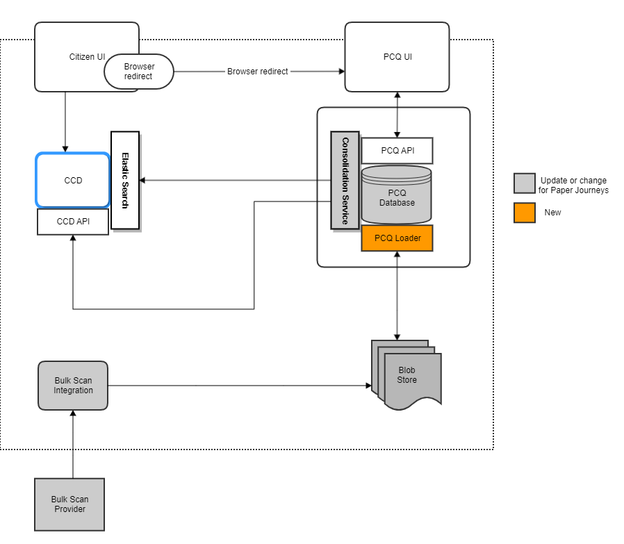

# Protected Characteristics Questionnaire 

[](https://opensource.org/licenses/MIT) [](https://sonarcloud.io/summary/new_code?id=PCQ) [](https://sonarcloud.io/summary/new_code?id=PCQ) [](https://sonarcloud.io/summary/new_code?id=PCQ) [](https://sonarcloud.io/summary/new_code?id=PCQ) [](https://sonarcloud.io/summary/new_code?id=PCQ)

This is the frontend for the protected characteristics questionnaire service. This service will ask a set of questions that will help us check we are treating people fairly and equally. It helps us to meet our commitment to equality (under the Equality Act 2010). 

## Overview

<p align="center">
<b><a href="https://github.com/hmcts/pcq-frontend">pcq-frontend</a></b> • <a href="https://github.com/hmcts/pcq-backend">pcq-backend</a> • <a href="https://github.com/hmcts/pcq-consolidation-service">pcq-consolidation-service</a> • <a href="https://github.com/hmcts/pcq-shared-infrastructure">pcq-shared-infrastructure</a> • <a href="https://github.com/hmcts/pcq-loader">pcq-loader</a>
</p>

<br>

<p align="center">
  
</p>

## Getting Started

### Prerequisites

- [Node.js](nodejs.org) >= 20.0.0
- [yarn](yarnpkg.com)

### Installation

Install dependencies by executing the following command:
```
$ yarn install
```

Sass:
```
$ yarn setup
```

Build a version file by running the following command:
```
$ yarn createVersionFile
```

Git hooks:

We have git hooks that enforce rules for commit messages.

These can be activated by running the following commands:
```
$ ln -s ./pre-commit.sh .git/hooks/pre-commit
$ ln -s ./commit-msg.sh .git/hooks/commit-msg
```

### Running the application

Run the application local server:
```
$ yarn start
```

Open [https://localhost:4000](https://localhost:4000) in a browser

## Developing

### Code style

`eslint` is a pre-commit requirement which is automatically run. This can be run manually using with `$ yarn lint`.

We have a number of rules relating to code style that can be found in [eslint.config.mjs](eslint.config.mjs).

### Config

For development only config, use the `dev.yaml` file. Running the app using `$ yarn start:dev` will set the node environment to `dev` to use this config.
This file is not version controlled so any config here will not be pushed to git.

As an example, if you want to use LanuchDarkly locally, place the SDK Key in this file. You can keep the key there as this file is not version controlled.

## Deployment and environment configuration

This service is deployed via Helm. The chart is in `charts/pcq-frontend/Chart.yaml` and uses the `nodejs` Helm dependency.

### Ingress and routing

- The service listens on port 4000.
- The ingress host is set via `nodejs.ingressHost` in `charts/pcq-frontend/values.yaml`.
- The default host pattern is `pcq.<environment>.platform.hmcts.net`.
- Ingress host is different for production environment.

### Environment configuration sources

- Baseline config lives in `config/default.yaml`.
- Environment-variable mapping is in `config/custom-environment-variables.yaml`.
- Deployment-time overrides are supplied via Helm values (see `charts/pcq-frontend/values.yaml`,
  `charts/pcq-frontend/values.aat.template.yaml`, and `charts/pcq-frontend/values.preview.template.yaml`).

### External services and secrets

- Redis: configured via `REDIS_HOST`, `REDIS_PORT`, and `REDIS_USE_TLS` in Helm values.
- PCQ backend: configured via `PCQ_BACKEND_URL` in Helm values.
- LaunchDarkly and App Insights: configured via secrets from Azure Key Vault.
- Service-to-service token keys: managed in Azure Key Vault and referenced by `keyVaults.pcq.secrets` in Helm values.

### Running the tests

Mocha is used for writing tests.

The test suite can be run with:
`$ yarn test`

For unit tests:
`$ yarn test:unit`

For component tests:
`$ yarn test:component`

For accessibility tests:
`$ yarn test:a11y`

For test coverage:
`$ yarn test:coverage`

## Registering a service with PCQ

When your service has got approval and is ready to integrate with PCQ 
you will firstly need to add your service to the [registered service JSON file](app/registeredServices.json).
Add a new object to the array with your service id, list of actors, and redirect links. 
The redirect link property name must match the property name of the [shutter page text](app/resources/en/translation/shutterpage.json) which will hold the link.
This property will define the name for the service when the user is on the shutter page in the case where the parameters have been lost. property is also added to the welsh resources.

When the PCQ service endpoint is called it will verify the serviceId that has been passed and is in the list of registered services. If it's not, the user will be shown the 'service down' page. 
The redirect link is used in case there is a problem with PCQ and the users session has been lost. In this case PCQ will not know the return url, that was passed in the invocation parameters, and will instead show a list of registered services and their associated redirect link. 

There are 3 pages which require specific wording regarding your service. 
Please see the [Variable text README](app/resources/en/translation/variable/README.md) for adding your services text.

The phone number for the service's accessibility helpline needs to be added to the [resource file](app/resources/en/translation/static/accessibility.json). 
Ensure this is also added to the welsh translations file. Once added, the [template](app/steps/ui/static/accessibility/template.html) will need to be updated to add the new line in. 
Add `content["list2-<service-name>"]` to the 2 unordered lists.

If there are questions you want to be excluded from the questionnaire because they are irrelevant (such as asking someone if they are married when coming from the divorce app), 
please see the [Journey README](app/journeys/README.md) for creating a service specific journey.

Check if service returnURL on production and other envirnments are  whitelisted in [string-utils.js] (app/components)

### Token key 

A new token key will need to be added in order to generate the token that authenticates the invoking service with PCQ.
This key is shared with the invoking service.

The following changes will need to be made to setup the token key in PCQ:

1. [Default config](config/default.yaml): Add a new property for the service in the `tokenKeys` object. This property needs to be all in lowercase letter. 
Set the value to `SERVICE_TOKEN_KEY`, this is the default key we use and will inform the logs if AKS is not being used.
2. [Environment config](config/custom-environment-variables.yaml): Add a new property in the `tokenKeys` object with the same name as created in the default.yaml file.
Set the value with the convention `<SERVICE_NAME>_TOKEN_KEY`.
3. [Chart values](charts/pcq-frontend/values.yaml): Add a new entry to `keyVaults.pcq.secrets` with the following convention `<service_name>-token-key`
4. [Secrets setup](app/setupSecrets.js): Add a new line under Token Keys comment with the following content: `setSecret('secrets.pcq.<Azure KeyVault Key Name>', 'tokenKeys.<Config property name>'); // SERVICE NAME`
The Azure KeyVault key name was defined in step 3. The Config property name was defined in step 1 and 2.
5. Generate a random token value using this site https://www.grc.com/passwords.htm and use the 63 random alpha-numeric characters (a-z, A-Z, 0-9) option
and add this key in vault with below command for pcq-aat,pcq-perftest and pcq-demo. For pcq-prod crate a separate token value and add.

az keyvault secret set --vault-name pcq-aat --name <service_name>-token-key --value <generated Value>
az keyvault secret set --vault-name pcq-perftest --name <service_name>-token-key --value <generated Value>
az keyvault secret set --vault-name pcq-demo --name <service_name>-token-key --value <generated Value>

az keyvault secret set --vault-name pcq-prod --name <service_name>-token-key --value <another generated Value>

IMPORTANT: This token key will also need to be added to the invoking service.

## Test

The following change need to made so that test will pass.

1. Add the new service in (test/unit/util/testInvoker.js.)
2. Add the new service redirect link in (test/unit/util/testShutterPage.js)
3. Add the new service rediret link property name in (test/component/testShutterPage.js)
4. Add the new service data in (test/unit/core/testServiceData.json)
5. Add the new service invoker data in (test/unit/services/testServiceInvokerData.json)


## License

This project is licensed under the MIT License - see the [LICENSE](LICENSE.md) file for details.
